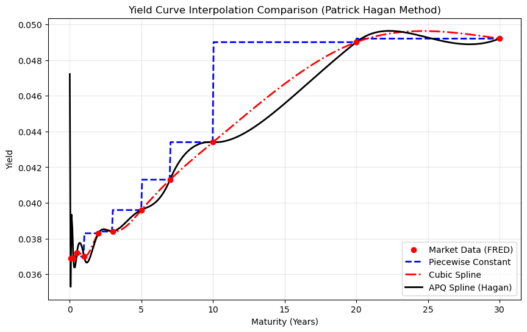
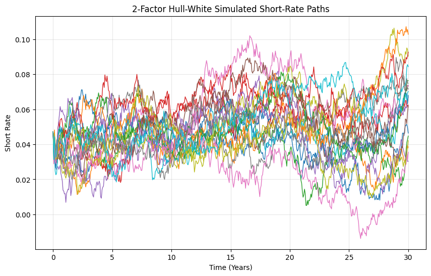
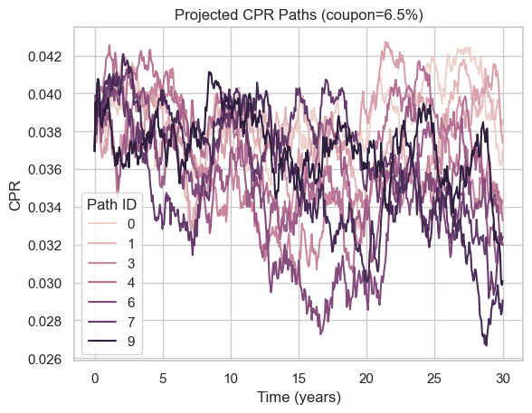
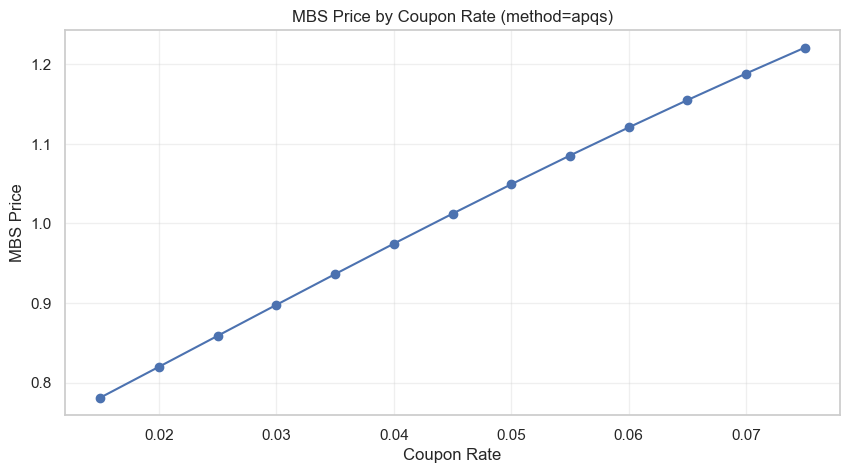

# STAT5030_Numerical_Methods_Group_Project
# Introduction：
This project prices Mortgage-Backed Securities by simulating prepayment behavior under realistic interest rate conditions. It is structured in four parts: Part 1 constructs a U.S. Treasury yield curve from live FRED data using three interpolation methods (Piecewise Constant, Cubic Spline, and the area-preserving quadratic spline APQS method). Part 2 calibrates a 2-Factor Hull-White model to the fitted curve and simulates short-rate paths via Monte Carlo. Part 3 models nonlinear prepayment (CPR) behavior across all simulated paths. 

---
# Part 1: Construct the Yield Curve
This part constructs a U.S. Treasury yield curve using real-time data from the Federal Reserve Economic Data (FRED) database, and provides three interpolation methods for curve fitting and rate extraction.


---

## Features

- **Live FRED Data Ingestion** — Fetches the latest available Treasury yields across 11 maturities (1-month to 30-year)
- **Three Interpolation Methods:**
  - Piecewise Constant: Returns the yield of the nearest tenor node to the left. Forward rates are constant within each interval, derived analytically from consecutive discount factors.
  - Cubic Spline: Uses SciPy's `CubicSpline` with natural boundary conditions fitted directly to the observed yields. Produces a smooth, twice-differentiable yield curve.
  - Area-Preserving Quadratic Spline (APQS)(Hagan, 2018): Forward rates are represented as quadratic within each interval. Solves a tridiagonal linear system to determine forward rate node values (`f_nodes`). The integral of the forward curve exactly reproduces the observed discount factors (area-preserving). In theory, avoids the "double hump" artifacts common in smart quadratic methods by enforcing continuity of the derivative at each node. In practice, performance depends on data quality and node spacing.

- **Rate Extraction Utilities** — Forward rates, discount factors, and zero rates for any maturity
- **Visualization** — Side-by-side comparison plot of all three interpolation methods

---

## Structure

```
├── 1. get_treasury_yields_from_fred()   # FRED data ingestion
├── 2. class YieldCurve                  # Interpolation engine
│   ├── __init__(self, maturities, yields)
        # Builds discount factors & piecewise forward rates
│   ├── get_interpolation(method)        # Returns callable yield curve function
│   ├── _build_apq_spline()              # APQS (Hagan) spline construction
│   ├── get_forward_rate(t, method)      # Instantaneous forward rate f(t)
│   ├── get_discount_factor(t, method)   # Discount factor P(0,t)
│   └── get_zero_rate(t, method)         # Zero/spot rate y(t)
└── 3. Visualization                     # Interpolation comparison plot
```

---


# Part 2: Calibrate and Simulate Interest Rate Paths
This part uses the fitted Treasury yield curve from Part 1 to initalize and simulate a 2-Factor Hull-White short-rate model under Monte Carlo. The model generates pathwise short-rate scenarios that will be used in part 3 for CPR modeling and in Part 4 for MBS valuation.

---

The short rate is modeled as 
$$r(t)=x(t)+y(t)+\phi(t)$$

where

$$dx(t) = -a x(t)dt+\sigma dW_1(t)$$

$$dy(t) = -b y(t)dt+\eta dW_2(t)$$

and 

$$\mathrm{corr}(dW_1,dW_2)=\rho$$

The deterministic shift term is

$$
\phi(t)=f(0,t)
+\frac{\sigma^2}{2a^2}(1-e^{-at})^2
+\frac{\eta^2}{2b^2}(1-e^{-bt})^2
+\frac{\rho\sigma\eta}{ab}(1-e^{-at})(1-e^{-bt})
$$

---

## Features

- **Yield Curve Interface** - Uses the fitted yield curve from Part 1 as the initial term structure input

- **Two-Factor Hull-White Model** - Models the short rate paths under the 2-factor Hull-White framework

- **Correlated Monte Carlo Simulation** - Simulates two correlated Brownian shocks to generate pathwise short-rate scenarios

- **Vasicek Benchmark Comparison** - Adds a simple one-factor Vasicek short-rate simulation for benchmark visualization. This is used only to compare mean-reverting behavior against the curve-consistent 2-Factor Hull-White model; the Hull-White paths remain the main input for CPR modeling and MBS valuation.

- **Path Statistics and Visualization** - Produce sample short-rate path plots together with the mean path and 90% simulation band

- **Scenario Export** - Converts simulated short-rate paths into a DataFrame for downstream CPR modeling and MBS valuation

---

## Structure

```
├── 1. Interface from Part 1           # Connect fitted yield curve
│   ├── Extract maturities and yields
│   ├── Initialize YieldCurve
│   ├── Compute f(0,t) and r(0)
│
├── 2. class HullWhiteModel            # Core 2-factor model
│   ├── __init__(self, yield_curve, a, b, sigma, eta, rho, method) 
│   │                       # Stores curve object and model parameters      
│   ├── f0(self, t)                    # Initial forward curve
│   ├── phi(self, t)                   # Deterministic shift term
│   └── simulate(self, T, n_steps, n_paths, seed)
│                           # Simulates x(t), y(t), and short-rate paths r(t)
│
├── 3. Simulation                      # Monte Carlo path generation
│   ├── Set a, b, sigma, eta, rho      # Parameter Specification
│   ├── Return rates, x_paths, y_paths, t_grid
│
├── ├── 4. Benchmark Vasicek Model         # Simple one-factor comparison model
│   ├── Simulate Vasicek short-rate paths
│   └── Compare against Hull-White mean path
│
├── 5. Visualization and Data Export   # Path plots and dataframe
```

---


# Part 3: Model Nonlinear Prepayment Behavior under changing interest rate conditions
## Using Monte Carlo Prepayment Methodologies

### 1. Prepayment Computation Framework
The foundational metrics for measuring prepayment speed are derived from the **Single Monthly Mortality (SMM)** and the **Conditional Prepayment Rate (CPR)**
The data is derived from Government website Freddiemac.com for real prepayment data report: https://capitalmarkets.freddiemac.com/mbs/daily-prepayment-report

#### Monthly Prepayment Rate (SMM)
The SMM represents the percentage of the outstanding principal balance (after scheduled payments) that was prepaid in a given month.

$$SMM = \text{Unscheduled Principal} / (\text{Beginning Balance} - \text{Scheduled Principal})$$

Based on the Freddie Mac Supplemental Daily Prepayment Report, we map the variables as follows:
* **Beginning Balance:** Cohort Current UPB
* **Scheduled Principal:** Scheduled Principal  
* **Unscheduled Principal:** Unscheduled Principal Reduction Amount

#### Annualized Prepayment Rate (CPR)
To annualize the monthly sentiment into a yearly expectation:

$$\text{CPR} = 1 - (1 - \text{SMM})^{12}$$

---
### 2. The Logistic Prepayment Model (S-Curve)
Refinancing behavior is non-linear. Homeowners do not respond to interest rate changes linearly; instead, they follow an **S-Curve** relationship. Prepayment speeds accelerate once a specific threshold is hit but plateau (burnout) as the pool of rational refinancers depletes.

To model this, we use the **Logistic Curve** equation:

$$\text{CPR}(t) = \text{CPR}_{\min} + (\text{CPR}_{\max} - \text{CPR}_{\min}) \cdot \frac{1}{1 + e^{-k(I_t - x_0)}}$$


**Variable Definitions:**
* **$I(t) = c - r(t)$**: The **Refinance Sentiment**. 
    * $c$: Original mortgage coupon rate.
    * $r(t)$: Current market rate (projected via the Hull-White Model).
* **$CPR_{min} / CPR_{max}$**: The floor and ceiling of prepayment speeds, determined via Bootstrap sampling.
* **$k$**: Sensitivity factor (how fast the market reacts to rate drops).
* **$x_0$**: Threshold (the spread required before refinancing becomes economically attractive).

---
### 3. Methodology: Bootstrap Monte Carlo
To avoid the limitations of deterministic cpr min and max models or assuming a perfect Normal distribution, we apply a **Bootstrap sampling** method within our Monte Carlo framework.

#### $CPR_{min} and CPR_{max}$
Instead of fixed values, we draw from the actual 2019 data distribution:
1.  **Lower and Higher Bounds ($CPR_{min}, CPR_{max}$):** We isolate the bottom 20% of the real CPR distribution and resample uniformly. This captures the "baseline" that accurately capture the CPR's behavior that follows S-Curve due to refinance incentives. We apply similar methods to CPR_max for 20 percent top of the distribution. 


#### The Simulation Process
1.  **Interest Rate Path:** Generate $r(t)$ using the **Hull-White short-rate model**.
2.  **Sentiment Calculation:** Compute $I(t)$ for each time step.
3.  **Bootstrap Draw:** For each simulation path, draw a $CPR_{min}$ and $CPR_{max}$ from the empirical 2019 dataset.
4.  **CPR Projection:** Apply the Logistic function to find the future projected prepayment rate.

---
### Summary of Results
By resampling uniformly from observed data points, the model captures **realistically skewed distributions**. This accounts for the fact that refinancing behavior is often suppressed by friction costs and "burnout," providing a more robust risk assessment for mortgage-backed securities than traditional Gaussian simulations.


# Part 4: MBS Valuation
This part implements Mortgage-Backed Security (MBS) valuation using simulated short rate paths from a Hull-White model and CPR projections from a refinancing model. It supports single- and multi-coupon pricing with pathwise discounting.

1. For the MBS valuation process, we now have two key inputs: short rate paths and CPR paths.

2. Now, our future cash flows follow the equation:

$$CF_t = \text{Interest}_t + \text{Scheduled Principal}_t + \text{Prepayment}_t$$

Where:
- $Interest_t = Balance_{t-1} \times q$ (where $q = Coupon Rate / 12$)
- $Scheduled Principal_t = \min(PMT - Interest_t, B_{t-1})$
- $Prepayment_t = SMM_t \times (B_{t-1} - Scheduled Principal_t)$

3. We discount the cash flows back using the discount factors ($DF_t$) derived from the Hull-White short-rate paths:

$$PV = \sum_{t=1}^{T} CF_t \times DF_t$$

4. Finally, we compute the average Present Value across all $N$ simulated paths to get the price of MBS:

$$\text{Value} = \frac{1}{N} \sum_{i=1}^{N} PV_i$$

---

## Features

**Simulated Short Rate Integration** — Uses Hull-White simulated short rate paths (`hw_rates`) with shape `(M × N+1)` for monthly discounting

**CPR Path Selection** — Retrieves path-specific CPR projections from `refi_df` based on the MBS coupon rate, pivoted to a `(M × N+1)` matrix

**Monte Carlo Pricing** — Returns the MBS price as the average of all path present values

**Multi-Coupon Support** — Prices multiple coupon rates in batch for sensitivity analysis

---

## Structure

```
├── 1. calculate_mbs_price()            # Core Monte Carlo pricing logic
│   ├── Compute monthly payment         # pmt = B0 × (q(1+q)^N) / ((1+q)^N - 1)
│   ├── Loop over each Monte Carlo path
│   └── Return average price + path PVs
│
├── 2. run_mbs_valuation()              # Wrapper to orchestrate simulation
│   ├── Load/simulate hw_rates          # Hull-White short rate paths (M × N+1)
│   ├── Load refi_df with CPR projections
│   ├── Call calculate_mbs_price()
│   └── Return price and path PVs
│
└── 3. Analysis & Visualization         # Coupon sensitivity plotting
```
---
# Conclusion：
After implementing the MBS valuation framework with Hull-White short rate paths and CPR projections, we obtained the following results from the four parts.

Part 1:
This plot compares three interpolation methods (Piecewise Constant, Cubic Spline, and APQS method) fitted to observed treasury yields. 



Part 2:
Using the yield curve fitted in Part 1 as the target term structure for calibration, the plot displays multiple interest rate paths via Monte Carlo simulation of a calibrated 2-Factor Hull-White model. A simple Vasicek benchmark is also included to show that Hull-White better preserves the shape of the initial forward curve through its deterministic shift term, while Vasicek mean-reverts toward a constant long-run level.



Part 3:
Prepayment behavior is modeled as a nonlinear function of interest rate movements, reflecting refinancing incentives. This figure shows how CPR evolves over time if we choose the coupon rate to be 6.5%.



Part 4:
Using short rate paths and CPR paths, we calculate our MBS price by discounting projected cash flows along each path and averaging the present values across all Monte Carlo simulations. This figure shows the calculated MBS prices under different coupon rates when we choose apqs method.



# Citations：
Hagan, P. S. (2018). Building curves using area preserving quadratic splines https://onlinelibrary.wiley.com/doi/abs/10.1002/wilm.10676
